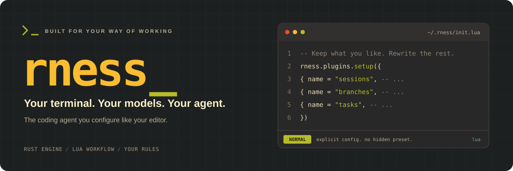

<div align="center">



# Rness

**Bring your editor mindset to your coding agent.**

A terminal-first coding agent with a Rust engine and a Lua-configurable workflow.<br />
Choose the models. Shape the interface. Build your own way of working.

<p>
  <a href="rust-toolchain.toml"></a>
  <a href="docs/guides/configuration/init-lua.md"></a>
  <a href="flavors/default/"></a>
  <a href="docs/project/known-limitations.md"></a>
</p>

**[Get started](#get-started)** &nbsp; · &nbsp;
**[Make it yours](#make-it-yours)** &nbsp; · &nbsp;
**[Read the docs](docs/README.md)** &nbsp; · &nbsp;
**[Explore examples](examples/)** &nbsp; · &nbsp;
**[Contribute](#contributing)**

</div>

---

## Your setup is the product

**The Neovim of coding agents.** Not because it copies your editor—but because you should own the setup. Choose the model, define specialist agents, remap keys, change the tool cards, and load exactly the plugins you want.

Start with the included **Gruvbox flavor**. Keep what you like. Rewrite the rest.

<table>
<tr>
<td width="50%" valign="top">
<h3>01 · Own the workflow</h3>
<p>Configure agents, actions, keybindings, hooks, and presentation in Lua. Build a setup—not just a system prompt.</p>
</td>
<td width="50%" valign="top">
<h3>02 · Build the missing pieces</h3>
<p>Add tools, slash commands, and terminal views through plugins. Extend the experience without modifying the Rust engine.</p>
</td>
</tr>
<tr>
<td width="50%" valign="top">
<h3>03 · Choose your specialists</h3>
<p>Define the roster, instructions, model profiles, and tool access. Generic children are off by default: delegation uses your named roles.</p>
</td>
<td width="50%" valign="top">
<h3>04 · Compose, don't conform</h3>
<p>Session pickers, plan review, task views, and agent controls are Lua plugins. Load only what you want—or replace it with your own.</p>
</td>
</tr>
</table>

**Rust handles the mechanisms. Lua shapes the experience. You own the decisions.**

If you enjoy maintaining your editor's dotfiles, rness brings that same approach to your coding agent—including the responsibility to review your plugins and configuration changes.

> [!IMPORTANT]
> **Early-stage software.** Configuration and extension APIs are evolving. Read the [known limitations](docs/project/known-limitations.md) and review changes before upgrading.

## From your terminal to your workflow

| Start with | Make it yours |
| :--- | :--- |
| **A model connection** | Anthropic, ChatGPT, OpenRouter, or local Ollama; choose credentials and model profiles explicitly |
| **A principal agent** | Configure its instructions and the specialist roles available for delegation |
| **A terminal interface** | Tune colors, message cards, keybindings, slash commands, and plugin views |
| **A durable session** | Resume work, manage branches, and control the context sent to the model |
| **The mode you need** | Interactive TUI, headless prompts, or an HTTP/SSE interface |

**[Browse the default flavor →](flavors/default/)** &nbsp; **[Understand the engine →](docs/architecture.md)**

## Get started

### 1. Install

**From GitHub:** install the current `main` source with one reviewed command:

```sh
curl --proto '=https' --tlsv1.2 -sSfL \
  https://raw.githubusercontent.com/Abraxas-365/rness/main/bootstrap.sh | sh
```

This requires Rust/Cargo, a native C/C++ build toolchain, Bash, `curl`, and `tar`. To let the bootstrapper install Rust through rustup when Cargo is unavailable:

```sh
curl --proto '=https' --tlsv1.2 -sSfL \
  https://raw.githubusercontent.com/Abraxas-365/rness/main/bootstrap.sh | RNESS_INSTALL_RUST=1 sh
```

For a reproducible installation, pin `RNESS_REF` to a reviewed tag or commit. The bootstrapper downloads that source archive over HTTPS, invokes its installer, writes `~/.local/bin/rness`, and copies the default flavor only when `~/.rness` does not exist.

**From a checkout:** Rust/Cargo and a Bash-compatible environment are required. From the repository root:

```sh
./install.sh
```

Both paths preserve an existing configuration. If needed, add the binary directory to your current shell's `PATH`:

```sh
export PATH="$HOME/.local/bin:$PATH"
```

> [!TIP]
> **Your config stays yours.** The installer never merges or overwrites existing configuration. It does not configure credentials, edit shell startup files, use sudo, or download models.

### 2. Connect a model

The default flavor declares connections for **Anthropic**, **ChatGPT**, **OpenRouter**, and **Ollama**. Credentials are configured separately; no principal model is selected for you.

**Sign in with ChatGPT or Anthropic using OAuth—an API key is not the only option.** Choose the authentication method for your connection:

#### ChatGPT: browser sign-in

The default `chatgpt` connection already uses OAuth:

```sh
rness auth login --provider openai-chatgpt
rness -m chatgpt/gpt-6-astra --reasoning high
```

The login provider is `openai-chatgpt`; the configured connection name used by `--model` is `chatgpt`.

#### Anthropic: browser sign-in

```sh
rness auth login --provider anthropic
```

Then edit the existing `anthropic` connection in `~/.rness/lua/providers.lua`, replacing its `auth = { env = "ANTHROPIC_API_KEY" }` field with:

```lua
auth = { oauth = "anthropic" },
```

Select an Anthropic model available to your account with `rness -m anthropic/YOUR_AVAILABLE_MODEL`. Reasoning support depends on the selected model.

OAuth access and available models depend on your account and the provider's current policies. Signing in does not guarantee access to every model. Check stored authentication with `rness auth status`.

#### API keys: an alternative for Anthropic

Keep the default environment-based Anthropic authentication and supply your key:

```sh
export ANTHROPIC_API_KEY="your-api-key"
```

#### Local models: Ollama

Use a model ID available to your account. To use a local model instead, start your Ollama server separately and select an installed, tool-capable model:

```sh
rness -m ollama/YOUR_INSTALLED_MODEL
```

Edit `~/.rness/lua/providers.lua` to customize connections and profiles. For authentication options, including OAuth, see the [provider reference](docs/reference/configuration/providers.md).

**Already have `~/.rness`?** These quickstart examples assume the bundled connection declarations. Compare your setup with [the default providers](flavors/default/lua/providers.lua) rather than replacing your configuration.

### 3. Put it to work

Open the terminal interface in your project:

```sh
rness -m chatgpt/gpt-6-astra --reasoning high
```

Or pass a prompt for a headless run:

```sh
rness -m chatgpt/gpt-6-astra --reasoning high \
  -p "Read this project and explain its entry points. Do not edit files."
```

> [!WARNING]
> The default approval policy is `allow`: sensitive tools run without confirmation. Add `--approval ask` to request approval, or `--approval never` to reject sensitive tools. Neither is an OS sandbox.

<details>
<summary><strong>Launch modes · interactive, headless, sessions, and server</strong></summary>

### Ways to launch Rness

| Mode | Command |
| :--- | :--- |
| Interactive, explicit model | `rness -m chatgpt/gpt-6-astra --reasoning high` |
| Separate connection and model arguments | `rness --provider chatgpt -m gpt-6-astra --reasoning high` |
| Saved profile | `rness --profile YOUR_PROFILE` |
| Named principal agent | `rness --agent coding -m chatgpt/gpt-6-astra --reasoning high` |
| Configured defaults | `rness` — requires a configured default selection/profile |
| One headless prompt | `rness -m chatgpt/gpt-6-astra --reasoning high -p "Explain this project"` |
| Resume a session | `rness -s SESSION_ID` |
| Resume with a prompt | `rness -s SESSION_ID -p "Continue the implementation"` |
| List saved sessions for the current directory | `rness --list` |
| HTTP/SSE server | `rness --serve 127.0.0.1:7777 -m chatgpt/gpt-6-astra --reasoning high` |
| Local Ollama model | `rness -m ollama/YOUR_INSTALLED_MODEL` |
| One-off OpenAI-compatible connection | `rness --route local=http://localhost:8000/v1,none -m local/YOUR_MODEL` |

Profiles and agents must exist in your Lua configuration. Resume restores the session's saved request configuration; its connection and credentials must still be available. Bind the server to loopback unless you have reviewed its security and deployment requirements. Use unauthenticated routes only for endpoints intended to accept them.

</details>

<details>
<summary><strong>File references · opt into browsing beyond the workspace</strong></summary>

### External file references

The `references` plugin keeps ordinary `@filename` searches inside the workspace.
Enable explicit external directory browsing through its Lua options:

```lua
{ name = "references", file = "plugins/references.lua", opts = {
  max_results = 20,
  allow_parent = true,   -- @../
  allow_home = true,     -- @~/
  allow_absolute = true, -- @/absolute/path/
} },
```

All three options default to false. External paths browse one directory level at
a time, without recursively indexing your home directory or attaching file contents.
Directory symlinks are not traversed. Parent traversal inside home or absolute paths
also requires `allow_parent`.

</details>

<details>
<summary><strong>Model controls · switch profiles and tune request options</strong></summary>

### Switching models inside a session

The default flavor's `models` Lua plugin provides slash commands with autocomplete
for profiles, provider/model, reasoning effort or token budget, temperature, and output limits.
Only declared supported settings are shown: model capabilities `temperature = true`
enable temperature; `output_token_limit = true` or a declared `max_output_tokens`
limit enables output limits (`output_token_limit = false` explicitly disables them).
Reasoning fields require declared `reasoning.efforts` or `reasoning.budget_tokens`.
Unknown capabilities are hidden, not guessed; slash commands also reject undeclared
settings, but `default` can always clear an old override.
Use `/profile` to list presets or `/profile NAME` to apply one.
Applying a profile replaces all generation options, clearing absent overrides,
while preserving the agent and tool permissions. It never edits the profile definition.
Provider-specific profiles use the session's current provider connection.
Enter models as `provider/model`; the provider must already be configured.
Model IDs can contain slashes.

Examples:

```text
/model chatgpt/gpt-6-astra
/model-settings reasoning high
/model-settings temperature 0.7
/model-settings max-output-tokens 8192
/model-settings budget-tokens 4096
/model-settings temperature default
```

`/model` and `/model-settings` without arguments show the current settings.
Changes persist only for the current session (including resume), preserve unrelated
settings, and are rejected while a turn is running. Use `default` to clear an override;
reasoning effort and token budget replace one another. Model switching clears options
not declared supported by the target model; clear any remaining incompatible values
(such as a different reasoning effort) first. This plugin edits explicit model IDs; it does not
fetch a remote model catalog or change credentials or defaults for new sessions.

### Reasoning and request options

```sh
# High reasoning (also accepted as --effort high)
rness -m chatgpt/gpt-6-astra --reasoning high

# Optional output limit
rness -m chatgpt/gpt-6-astra --reasoning high --max-output-tokens 8192
```

| Option | What it controls |
| :--- | :--- |
| `--reasoning LEVEL` / `--effort LEVEL` | Named reasoning effort, such as `low`, `medium`, or `high`. Accepted levels depend on the provider and model. |
| `--budget-tokens TOKENS` | Anthropic manual thinking budget, minimum 1,024 tokens. Cannot be combined with named reasoning effort. |
| `--max-output-tokens TOKENS` | Maximum output tokens per provider request. |
| `--temperature VALUE` | Sampling temperature, where supported by the selected model. |
| `--approval allow\|ask\|never` | Allow tools without questions, ask for sensitive tools, or reject sensitive tools. Default: `allow`. |

Reasoning effort is not a universal model capability. Do not assume every model supports every level, manual thinking, or temperature; use options supported by your selected endpoint.

</details>

<details>
<summary><strong>More CLI options and shortcuts</strong></summary>

| Option | Purpose |
| :--- | :--- |
| `-m`, `--model` | Select `connection/model`; with `--provider`, supply a literal model ID instead. |
| `--account NAME` | Use a named stored credential for the selected connection (e.g. a second Anthropic account); see [multiple accounts](docs/reference/configuration/providers.md#multiple-accounts-per-provider). |
| `-p`, `--prompt` | Run a headless prompt and print the transcript. |
| `-s`, `--session` | Continue an existing session. |
| `--profile` / `--agent` | Select a declared profile or agent. |
| `--base-url URL` | Override the selected provider endpoint. |
| `--route SPEC` | Declare an OpenAI-compatible connection; repeat for multiple connections. |
| `--root DIR` | Change session storage from `~/.rness/sessions`; this is not the workspace directory. |
| `--instructions NAMES` | Comma-separated instruction filenames in precedence order; default: `AGENTS.md,CLAUDE.md`. Use `none` to disable. |
| `--instructions-bytes BYTES` | Instruction baseline byte budget; default: `65536`. |
| `--serve ADDR` | Run the HTTP/SSE service instead of the TUI. |
| `--list` | List sessions whose saved workspace matches the current directory and exit (not the entire repository or subdirectories; sessions without a saved workspace are omitted). |
| `-h`, `--help` | Show the current CLI reference. |
| `-V`, `--version` | Print the installed version. |

Credential and package management are separate subcommands:

```sh
rness auth --help
rness plugin --help
rness --help
```

</details>

<details>
<summary><strong>Upgrading and alternative installation options</strong></summary>

Upgrade the binary from your updated checkout without changing your configuration:

```sh
./install.sh --replace-binary
```

Install an executable you have already built:

```sh
./install.sh --binary /path/to/rness
```

Add `--replace-binary` if an executable already exists at the destination.

- `--experimental-control` opts into the experimental local submission API
  (`--control-socket` and `rness send`); normal builds/installations omit it.
  Runtime listeners still require an explicit flag. See the
  [experimental control guide](docs/guides/control-socket.md) for durable queue
  semantics, limits, and unvalidated Windows named-pipe support.
- `--bin-dir DIR` changes the binary destination.
- `--config-dir DIR` changes where the installer copies the flavor, **not** the runtime configuration lookup: rness still reads `$HOME/.rness`.
- Existing configuration is preserved, including during binary upgrades.

See [installation from source](docs/guides/installation/from-source.md) for more build details.

</details>

## Make it yours

The default flavor is **ordinary configuration**, not a hidden preset inside the binary:

```text
~/.rness/
├── init.lua             Load exactly what you want
├── lua/
│   ├── providers.lua    Connections and model profiles
│   ├── agents.lua       Principal and specialist agents
│   └── theme.lua        Gruvbox, message cards, and diffs
└── plugins/             Explicitly loaded Lua plugins
```

### Plugins you can actually see

The startup file lists plugin files explicitly. No directory-scanning surprises:

```lua
rness.plugins.setup({
  { name = "sessions", file = "plugins/sessions.lua" },
  { name = "branches", file = "plugins/branches.lua" },
  { name = "tasks", file = "plugins/tasks.lua" },
})
```

This is a shortened example of the existing setup list—not an additional setup call to paste alongside it. Edit the list in `~/.rness/init.lua` to choose your own set.

### Keys that fit your hands

Replace the default flavor's empty `rness.keymap.setup({})` with your mappings. For example, to scroll by page:

```lua
rness.keymap.setup({
  { scope = "global", key = "ctrl+u", action = "core.scroll_up_page" },
  { scope = "global", key = "ctrl+d", action = "core.scroll_down_page" },
})
```

Restart rness after startup configuration changes. Explore [scoped mappings](docs/guides/plugins/loading-and-lifecycle.md#scoped-mappings-and-help), [colorschemes](docs/guides/configuration/colorschemes.md), and [messagebox presentation](docs/guides/plugins/example-recipes.md#messagebox-presentation).

## Delegate the search. Keep the context.

Use a focused scout to investigate, a worker to implement, and a reviewer to inspect the result. The broader [specialist examples](examples/lua/roles.lua) also include a planner and other roles.

| Bundled role | Purpose | Current configuration |
| :--- | :--- | :--- |
| `scout` | Find relevant code and return a concise handoff | Uses `small`; allows Glob, Grep, Read, and Bash |
| `worker` | Make changes and run checks | Inherits the available tools; instructions prohibit unauthorized actions |
| `reviewer` | Inspect changes and identify risks | Instructions request read-only review; no explicit tool allowlist |

The scout's `small` profile resolves against the **parent's current provider connection**. The default flavor includes Anthropic Haiku and ChatGPT Luna mappings; OpenRouter and Ollama need model IDs you choose. Account availability still applies. A missing mapping fails explicitly—there is no silent cross-provider fallback.

Roles without a profile inherit the principal's model settings. Background one-shot jobs notify their parent on completion and wake it if idle, without a fixed wake-count limit. Results remain accessible through `job_output`. Background Bash and one-shot subagent calls require `job_output`, `job_list`, and `job_kill` in the calling session's effective tool allowlist; otherwise they are rejected before starting work. Foreground calls remain available. Continuable agents use their separate agent controls rather than job controls.

> [!NOTE]
> **A child session is not a sandbox.** Specialists share the workspace; delegation does not create isolated git worktrees. Read-only instructions are not enforced tool restrictions. For a strictly limited exploration role, explicitly allow only `Glob`, `Grep`, and `Read`—Bash can modify files.

See [your first agent](docs/tutorials/first-agent.md) and [the specialist examples](examples/lua/roles.lua).

## Long conversations, explicit control

rness separates the durable session history from the context sent to the model. The default flavor enables automatic summarization at **165,000 estimated tokens** and microcompaction of older tool outputs above **8,192 characters**, retaining their head and tail. Compaction reduces only model context: the original messages remain visible in the transcript and durable session log, with a summary card placed at the folded span. Run **`/compact`** to summarize the current context immediately, without a region picker.

The summary card is configured through `rness.ui.messagebox.compaction`; see [Messagebox presentation](docs/guides/plugins/example-recipes.md#messagebox-presentation) for preview and expansion options.

Automatic summaries retain roughly 24,000 tokens of recent context and request up to 4,096 output tokens. Configure lower thresholds for models with smaller context windows; estimates are not exact tokenization. Explicit `provider/model` policies override `rness.compaction.default`.

## Go deeper

| If you're here to… | Start here |
| :--- | :--- |
| Configure your first session | [First configuration](docs/tutorials/first-configuration.md) |
| Understand connections, profiles, and agents | [Configuration concepts](docs/explanation/providers-models-profiles-agents.md) |
| Organize your Lua setup | [The init.lua guide](docs/guides/configuration/init-lua.md) |
| Write and manage plugins | [Loading and lifecycle](docs/guides/plugins/loading-and-lifecycle.md) |
| Understand the engine | [Architecture](docs/architecture.md) |
| Check current constraints | [Known limitations](docs/project/known-limitations.md) |

<details>
<summary><strong>Inside the repository</strong></summary>

| Path | Responsibility |
| :--- | :--- |
| `crates/rness-kernel` | Plugin services, typed events, and disposers |
| `crates/rness-protocol` | Shared event and wire types |
| `crates/rness-engine` | Sessions, branching, turn execution, and context management |
| `crates/rness-providers` | Provider adapters |
| `crates/rness-tools` | File, shell, delegation, and job tools |
| `crates/rness-lua` | Lua runtime and extension API |
| `crates/rness-tui` | Terminal interface |
| `crates/rness-server` | HTTP/SSE service interface |
| `crates/rness-cli` | Binary and composition root |
| `flavors/default` | Installable starter configuration |
| `examples` | Copyable configuration and plugins |
| `docs` | Tutorials, guides, references, and design notes |

The architecture document includes design intent; it is not a promise that every described subsystem is complete.

</details>

## Contributing

Good bug reports, focused fixes, and useful Lua examples are welcome. Start with the [contributor documentation](docs/contributing/README.md).

Include reproduction steps and relevant version/configuration details. Remove credentials, private source code, and sensitive session content before sharing logs.

Useful checks from the repository root:

```sh
cargo test -p rness-engine -p rness-tools
cargo test -p rness-lua --test example_plugins
python3 scripts/test_install.py
```

---

<div align="center">

**An agent should adapt to your workflow. Not the other way around.**

[Get started](#get-started) · [Browse the default flavor](flavors/default/) · [Read the docs](docs/README.md)

</div>
